# About

* Potree is a free open-source WebGL based point cloud renderer for large point clouds. It is based on the [TU Wien Scanopy project](https://www.cg.tuwien.ac.at/research/projects/Scanopy/) and research projects [Harvest4D](https://harvest4d.org/), [GCD Doctoral College](https://gcd.tuwien.ac.at/) and [Superhumans](https://www.cg.tuwien.ac.at/research/projects/Superhumans/).
* Newest information and work in progress is usually available on [twitter](https://twitter.com/m_schuetz)
* Contact: Markus Schütz (mschuetz@potree.org)
* References: 
    * [Potree: Rendering Large Point Clouds in Web Browsers](https://www.cg.tuwien.ac.at/research/publications/2016/SCHUETZ-2016-POT/SCHUETZ-2016-POT-thesis.pdf) (2016)
    * [Fast Out-of-Core Octree Generation for Massive Point Clouds](https://www.cg.tuwien.ac.at/research/publications/2020/SCHUETZ-2020-MPC/) (2020)
    
<a href="http://potree.org/wp/demo/" target="_blank">  </a>

# Getting Started

### Install on your PC

Install [node.js](http://nodejs.org/)

Install dependencies, as specified in package.json, and create a build in ./build/potree.

```bash
npm install
```

### Run on your PC

Use the `npm start` command to 

* create ./build/potree 
* watch for changes to the source code and automatically create a new build on change
* start a web server at localhost:1234. 

Go to http://localhost:1234/examples/ to test the examples.

### Deploy to a server

* Simply upload the Potree folderm with all your point clouds, the build directory, and your html files to a web server.
* It is not required to install node.js on your webserver. All you need is to host your files online. 

### Convert Point Clouds to Potree Format

Download [PotreeConverter](https://github.com/potree/PotreeConverter) and run it like this:

    ./PotreeConverter.exe C:/pointclouds/data.las -o C:/pointclouds/data_converted

Copy the converted directory into &lt;potreeDirectory&gt;/pointclouds/data_converted. Then, duplicate and rename one of the examples and modify the path in the html file to your own point cloud.

# Downloads

* [Potree](https://github.com/potree/potree/releases)
* [PotreeConverter ](https://github.com/potree/PotreeConverter/releases) - Convert your point cloud to the Potree format.
* [PotreeDesktop ](https://github.com/potree/PotreeDesktop/releases) - Desktop version of Potree. Allows drag&drop of point clouds into the viewer.

# Examples

<table>
	<tr>
		<td style="padding: 0px">
			<a href="http://potree.org/potree/examples/viewer.html" target="_blank">
				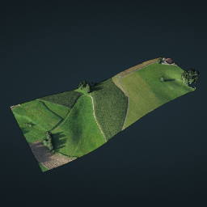
			</a>
		</td><td>
			<a href="http://potree.org/potree/examples/ca13.html" target="_blank">
				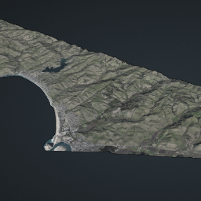
			</a>
		</td><td>
			<a href="http://potree.org/potree/examples/cesium_retz.html" target="_blank">
				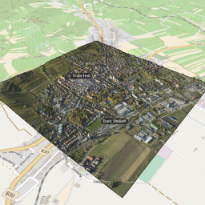
			</a>
		</td><td>
			<a href="http://potree.org/potree/examples/classifications.html" target="_blank">
				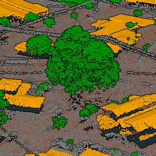
			</a>
		</td><td>
			<a href="http://potree.org/potree/examples/features_sorvilier.html" target="_blank">
				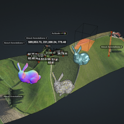
			</a>
		</td><td>
			<a href="http://potree.org/potree/examples/toolbar.html" target="_blank">
				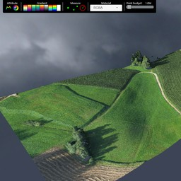
			</a>
		</td>
	</tr>
	<tr>
		<th>Basic Viewer</th><th>CA13 (18 billion Points)</th><th>Retz (Potree + Cesium)</th><th>Classifications</th><th>Various Features</th><th>Toolbar</th>
	</tr>
</table>

<details>
<summary>More Examples</summary>


<table>
	<tr>
		<td>
			<a href="http://potree.org/potree/examples/load_project.html" target="_blank">
				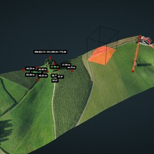
			</a>
		</td><td>
			<a href="http://potree.org/potree/examples/matcap.html" target="_blank">
				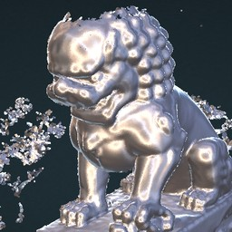
			</a>
		</td><td>
			<a href="https://potree.org/potree/examples/vr_heidentor.html" target="_blank">
				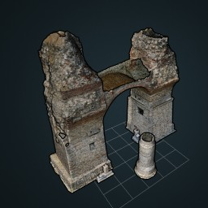
			</a>
		</td><td>
			<a href="http://potree.org/potree/examples/heidentor.html" target="_blank">
				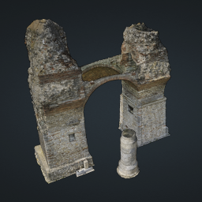
			</a>
		</td><td>
			<a href="http://potree.org/potree/examples/lion.html" target="_blank">
				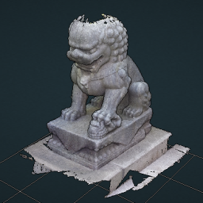
			</a>
		</td><td>
			<a href="http://potree.org/potree/examples/lion_las.html" target="_blank">
				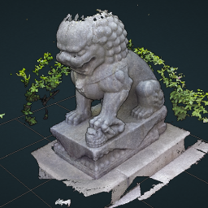
			</a>
		</td>
	</tr>
	<tr>
		<th>Load Project</th><th>Matcap</th><th>Virtual Reality</th><th>Heidentor</th><th>Lion</th><th>Lion LAS</th>
	</tr><tr>
		<td>
			<a href="http://potree.org/potree/examples/lion_laz.html" target="_blank">
				
			</a>
		</td><td>
			<a href="http://potree.org/potree/examples/ept.html" target="_blank">
				
			</a>
		</td><td>
			<a href="http://potree.org/potree/examples/ept_binary.html" target="_blank">
				
			</a>
		</td><td>
			<a href="http://potree.org/potree/examples/ept_zstandard.html" target="_blank">
				
			</a>
		</td><td>
			<a href="http://potree.org/potree/examples/clipping_volume.html" target="_blank">
				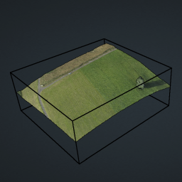
			</a>
		</td><td>
			<a href="http://potree.org/potree/examples/oriented_images.html" target="_blank">
				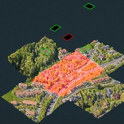
			</a>
		</td>
	</tr>
	<tr>
		<th>Lion LAZ</th><th>EPT</th><th>EPT Binary</th><th>EPT zstandard</th><th>Clipping Volume</th><th>Oriented Images</th>
	</tr><tr>
		<td>
			<a href="http://potree.org/potree/examples/elevation_profile.html" target="_blank">
				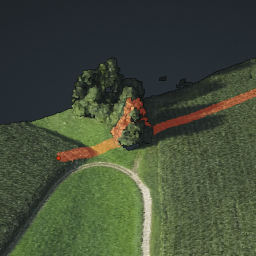
			</a>
		</td><td>
			<a href="http://potree.org/potree/examples/measurements.html" target="_blank">
				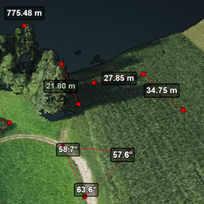
			</a>
		</td><td>
			<a href="http://potree.org/potree/examples/meshes.html" target="_blank">
				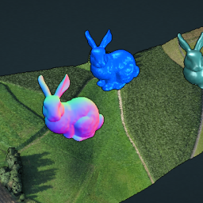
			</a>
		</td><td>
			<a href="http://potree.org/potree/examples/multiple_pointclouds.html" target="_blank">
				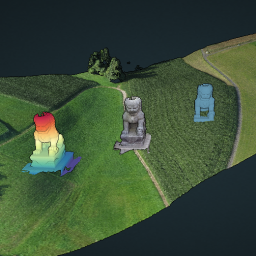
			</a>
		</td><td>
			<a href="http://potree.org/potree/examples/camera_animation.html" target="_blank">
				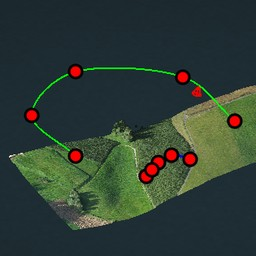
			</a>
		</td><td>
			<a href="http://potree.org/potree/examples/features_ca13.html" target="_blank">
				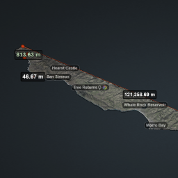
			</a>
		</td>
	</tr>
	<tr>
		<th>Elevation Profile</th><th>Measurements</th><th>Meshes</th><th>Multiple Point Clouds</th><th>Camera Animation</th><th>Features (CA13)</th>
	</tr><tr>
		<td>
			<a href="http://potree.org/potree/examples/annotations.html" target="_blank">
				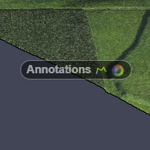
			</a>
		</td><td>
			<a href="http://potree.org/potree/examples/annotation_hierarchy.html" target="_blank">
				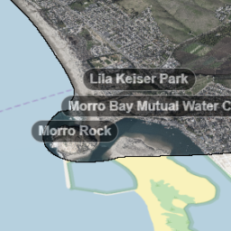
			</a>
		</td><td>
			<a href="http://potree.org/potree/examples/animation_paths.html" target="_blank">
				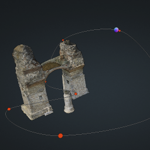
			</a>
		</td><td>
			<a href="http://potree.org/potree/examples/shapefiles.html" target="_blank">
				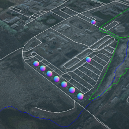
			</a>
		</td><td>
			<a href="http://potree.org/potree/examples/cesium_ca13.html" target="_blank">
				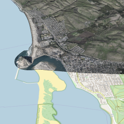
			</a>
		</td><td>
			<a href="http://potree.org/potree/examples/geopackage.html" target="_blank">
				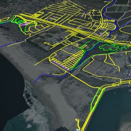
			</a>
		</td>
	</tr>
	<tr>
		<th>Annotations</th><th>Hierarchical Annotations</th><th>Animation Path</th><th>Shapefiles</th><th>Cesium CA13</th><th>Geopackage</th>
	</tr><tr>
		<td>
			<a href="http://potree.org/potree/examples/cesium_sorvilier.html" target="_blank">
				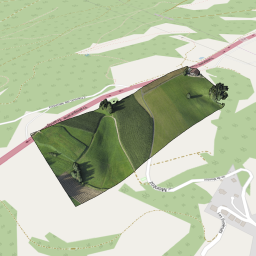
			</a>
		</td><td>
			<a href="http://potree.org/potree/examples/custom_sidebar_section.html" target="_blank">
				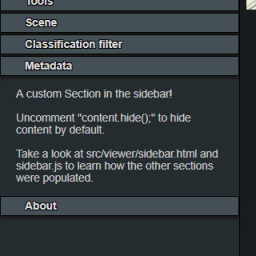
			</a>
		</td><td>
			<a href="http://potree.org/potree/examples/embedded_iframe.html" target="_blank">
				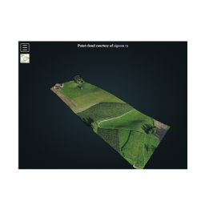
			</a>
		</td><td>
			<a href="http://potree.org/potree/examples/gradient_colors.html" target="_blank">
				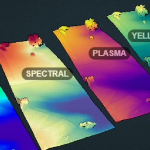
			</a>
		</td>
	</tr>
	<tr>
		<th>Cesium Sorvilier</th><th>Custom Sidebar Section</th><th>Embedded Iframe</th><th>Gradient Colors</th>
	</tr>
</table>
</details>

# VR

<table>
	<tr>
		<td>
			<a href="https://potree.org/potree/examples/vr_heidentor.html" target="_blank">
				
			</a>
		</td><td>
			<a href="https://potree.org/potree/examples/vr_eclepens.html" target="_blank">
				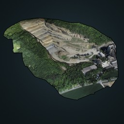
			</a>
		</td><td>
			<a href="https://potree.org/potree/examples/vr_morro_bay.html" target="_blank">
				
			</a>
		</td><td>
			<a href="https://potree.org/potree/examples/vr_lion.html" target="_blank">
				
			</a>
		</td><td>
			<a href="https://potree.org/potree/examples/vr_dechen_cave.html" target="_blank">
				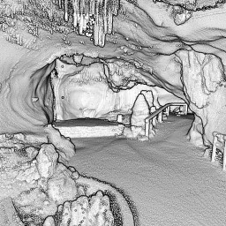
			</a>
		</td>
	</tr>
	<tr>
		<th>Heidentor</th><th>Eclepens</th><th>Morro Bay</th><th>Lion</th><th>Dechen Cave</th>
	</tr>
</table>

# Showcase

<table>
	<tr>
		<td>
			<a href="http://potree.org/potree/examples/showcase/matterhorn.html" target="_blank">
				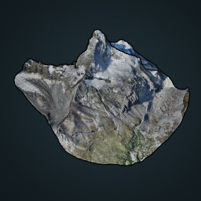
			</a>
		</td><td>
			<a href="http://potree.org/potree/examples/showcase/retz.html" target="_blank">
				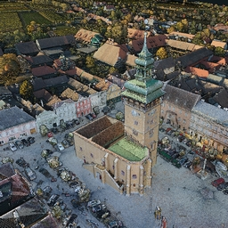
			</a>
		</td><td>
			<a href="http://potree.org/potree/examples/showcase/lake_tahoe.html" target="_blank">
				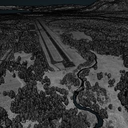
			</a>
		</td><td>
			<a href="http://potree.org/potree/examples/showcase/sorvilier.html" target="_blank">
				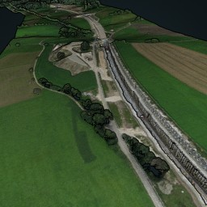
			</a>
		</td><td>
			<a href="http://potree.org/potree/examples/showcase/grab_15.html" target="_blank">
				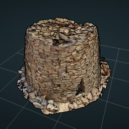
			</a>
		</td><td>
			<a href="http://potree.org/potree/examples/showcase/tern_auscover_chowilla.html" target="_blank">
				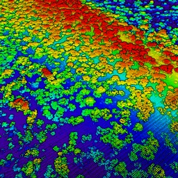
			</a>
		</td>
	</tr>
	<tr>
		<th>Matterhorn</th><th>Retz</th><th>Lake Tahoe</th><th>Sorvilier</th><th>Grave</th><th>Chowilla</th>
	</tr>
</table>

<details>
<summary>More</summary>

<table>
	<tr>
		<td>
			<a href="http://potree.org/potree/examples/showcase/chiller.html" target="_blank">
				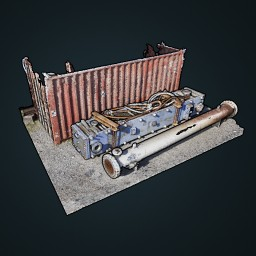
			</a>
		</td><td>
			<a href="http://potree.org/potree/examples/showcase/cooler_tower.html" target="_blank">
				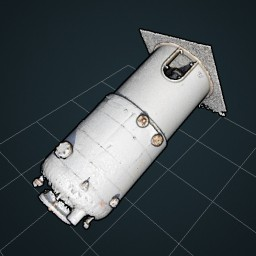
			</a>
		</td><td>
			<a href="http://potree.org/potree/examples/showcase/dechen_cave.html" target="_blank">
				
			</a>
		</td><td>
			<a href="http://potree.org/potree/examples/showcase/doverMillRuins.html" target="_blank">
				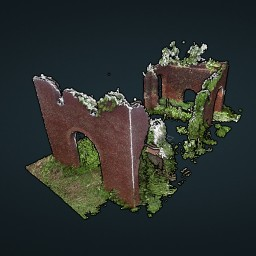
			</a>
		</td><td>
			<a href="http://potree.org/potree/examples/showcase/eclepens.html" target="_blank">
				
			</a>
		</td><td>
			<a href="http://potree.org/potree/examples/showcase/heidentor.html" target="_blank">
				
			</a>
		</td>
	</tr>
	<tr>
		<th>Chiller</th><th>Cooler</th><th>Dechen Cave</th><th>Ruins</th><th>Eclepens</th><th>Heidentor</th>
	</tr><tr>
		<td>
			<a href="http://potree.org/potree/examples/showcase/land_building.html" target="_blank">
				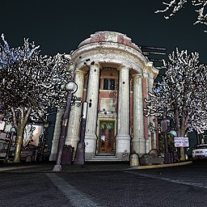
			</a>
		</td><td>
			<a href="http://potree.org/potree/examples/showcase/LDHI_module.html" target="_blank">
				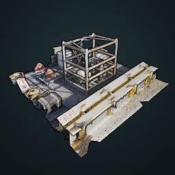
			</a>
		</td><td>
			<a href="http://potree.org/potree/examples/showcase/lion_head_simone_garagnani.html" target="_blank">
				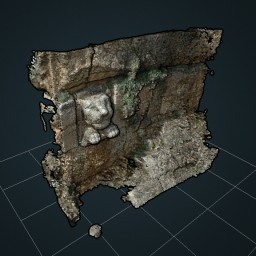
			</a>
		</td><td>
			<a href="http://potree.org/potree/examples/showcase/overpass.html" target="_blank">
				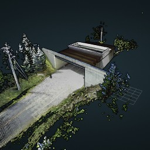
			</a>
		</td><td>
			<a href="http://potree.org/potree/examples/showcase/pielach.html" target="_blank">
				
			</a>
		</td><td>
			<a href="http://potree.org/potree/examples/showcase/pompei.html" target="_blank">
				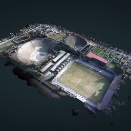
			</a>
		</td>
	</tr>
	<tr>
		<th>Building</th><th>LDHI</th><th>Lion Head</th><th>Overpass</th><th>Pielach</th><th>pompei</th>
	</tr><tr>
		<td>
			<a href="http://potree.org/potree/examples/showcase/santorini.html" target="_blank">
				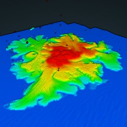
			</a>
		</td><td>
			<a href="http://potree.org/potree/examples/showcase/skatepark.html" target="_blank">
				
			</a>
		</td><td>
			<a href="http://potree.org/potree/examples/showcase/subsea_equipment.html" target="_blank">
				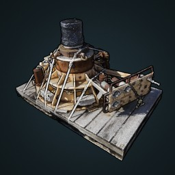
			</a>
		</td><td>
			<a href="http://potree.org/potree/examples/showcase/subsea_manifold.html" target="_blank">
				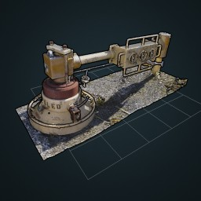
			</a>
		</td><td>
			<a href="http://potree.org/potree/examples/showcase/westend_palais.html" target="_blank">
				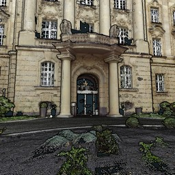
			</a>
		</td><td>
			<a href="http://potree.org/potree/examples/showcase/whitby.html" target="_blank">
				
			</a>
		</td>
	</tr>
	<tr>
		<th>Santorini</th><th>Skatepark</th><th>Subsea Eq.</th><th>Subsea Man.</th><th>Westend Palais</th><th>Whitby</th>
	</tr>
</table>

</details>

# Funding

Potree is funded by a combination of research projects, companies and institutions. 

Research projects who's funding contributes to Potree:

<table>
	<tr>
		<th>Project Name</th>
		<th>Funding Agency</th>
	</tr>
	<tr>
		<td><a href="https://projekte.ffg.at/projekt/3851914">LargeClouds2BIM</a></td>
		<td><a href="https://www.ffg.at/">FFG</a></td>
	</tr>
	<tr>
		<td><a href="https://harvest4d.org/">Harvest4D</a></td>
		<td><a href="https://ec.europa.eu/transport/themes/research/fp7_en">EU 7th Framework Program 323567</a></td>
	</tr>
	<tr>
		<td><a href="https://gcd.tuwien.ac.at/">GCD Doctoral College</a></td>
		<td><a href="https://www.tuwien.at/en/">TU Wien</a></td>
	</tr>
	<tr>
		<td><a href="https://www.cg.tuwien.ac.at/research/projects/Superhumans/">Superhumans</a></td>
		<td><a href="https://www.fwf.ac.at/">FWF</a></td>
	</tr>
</table>

We would like to thank our sponsors for their financial contributions that keep this project up and running!

<table>
	<tr>
		<th>
			Diamond<br>
			€ 15,000+
		</th>
		<td>
			<a href="http://www.ne.ch/autorites/DDTE/SGRF/SITN/Pages/accueil.aspx">
				 &nbsp;
			</a> &nbsp;
			<a href="http://www.synth3d.co">
				
			</a> &nbsp;
			<a href="http://www.geocue.com">
				
			</a> &nbsp;
			<a href="http://rapidlasso.com">
				
			</a> &nbsp;
		</td>
	</tr>
	<tr>
		<th>
			Gold<br>
			€ 10,000+
		</th>
		<td>
			<a href="https://www.bart.gov">
				
			</a>
		</td>
	</tr>
	<tr>
		<th>
			Silver<br>
			€ 5,000+
		</th>
		<td>
			<a href="https://biology.anu.edu.au/research/facilities/australian-plant-phenomics-facility-anu">
				 &nbsp;
			</a>
			<a href="https://www.limit-addict.fr/">
				
			</a>
			<a href="http://georepublic.info">
				
			</a>
		</td>
	</tr>
	<tr>
		<th>
			Bronze<br>
			€ 1,000+
		</th>
		<td>
			<a href="https://www.unstruk.com/">
				 &nbsp;
			</a>
			<a href="http://scanx.com/">
				 &nbsp;
			</a>
			<a href="https://www.phoenixlidar.com/">
				 &nbsp;
			</a>
			<a href="https://www.eventart.at/">
				 &nbsp;
			</a>
			<a href="https://www.geodelta.com/">
				 &nbsp;
			</a>
			<a href="https://www.e-cassini.fr/">
				 &nbsp;
			</a>
			<a href="https://www.sogelink.fr/">
				 &nbsp;
			</a>
			<b>Data-viewer</b>
			<a href="http://www.helimap.com/">
				 &nbsp;
			</a>
			<a href="http://www.vevey.ch/">
				 &nbsp;
			</a>
			<a href="https://www.yverdon-les-bains.ch/">
				 &nbsp;
			</a>
			<a href="http://archpro.lbg.ac.at">
				 
			</a> &nbsp;
			<br>
			<a href="http://www.kts.co.jp">
				 &nbsp;
			</a>
			<a href="http://veesus.com">
				 &nbsp;
			</a>
			<a href="http://www.sigeom.ch">
				 &nbsp;
			</a>
		</td>
	</tr>
</table>


# Credits

* The multi-res-octree algorithms used by this viewer were developed at the Vienna University of Technology by Michael Wimmer and Claus Scheiblauer as part of the [Scanopy Project](http://www.cg.tuwien.ac.at/research/projects/Scanopy/).
* [Three.js](https://github.com/mrdoob/three.js), the WebGL 3D rendering library on which potree is built.
* [plas.io](http://plas.io/) point cloud viewer. LAS and LAZ support have been taken from the laslaz.js implementation of plas.io. Thanks to [Uday Verma](https://twitter.com/udaykverma) and [Howard Butler](https://twitter.com/howardbutler) for this!
* [Harvest4D](https://harvest4d.org/) Potree currently runs as Master Thesis under the Harvest4D Project
* Christian Boucheny (EDL developer) and Daniel Girardeau-Montaut ([CloudCompare](http://www.danielgm.net/cc/)). The EDL shader was adapted from the CloudCompare source code!
* [Martin Isenburg](http://rapidlasso.com/), [Georepublic](http://georepublic.de/en/),
[Veesus](http://veesus.com/), [Sigeom Sa](http://www.sigeom.ch/), [SITN](http://www.ne.ch/sitn), [LBI ArchPro](http://archpro.lbg.ac.at/),  [Pix4D](http://pix4d.com/) as well as all the contributers to potree and PotreeConverter and many more for their support.
