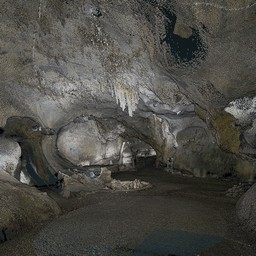

# About

Potree is a free open-source WebGL based point cloud renderer for large point clouds. It is based on the [TU Wien Scanopy project](https://www.cg.tuwien.ac.at/research/projects/Scanopy/) and research projects [Harvest4D](https://harvest4d.org/), [GCD Doctoral College](https://gcd.tuwien.ac.at/) and [Superhumans](https://www.cg.tuwien.ac.at/research/projects/Superhumans/).


<a href="http://potree.org/wp/demo/" target="_blank">  </a>

Newest information and work in progress is usually available on [twitter](https://twitter.com/m_schuetz)

Contact: Markus Schütz (mschuetz@potree.org)

Reference: [Potree: Rendering Large Point Clouds in Web Browsers](https://www.cg.tuwien.ac.at/research/publications/2016/SCHUETZ-2016-POT/SCHUETZ-2016-POT-thesis.pdf)

# Getting Started

### Build and Run

Install [node.js](http://nodejs.org/)

Install all dependencies, as specified in package.json: 

```bash
npm install
```

Use `npm run build` to create ./build/potree.

Use the `npm start` command to 

* create ./build/potree 
* watch for changes to the source code and automatically create a new build on change
* start a web server at localhost:1234. 

Go to http://localhost:1234/examples/ to test the examples.

### Convert

Download [PotreeConverter](https://github.com/potree/PotreeConverter) and run it like this:

    ./PotreeConverter.exe C:/pointclouds/data.las -o C:/pointclouds/data_converted

Copy the converted directory into &lt;potreeDirectory&gt;/pointclouds/data_converted. Then, duplicate and rename one of the examples and modify the path in the html file to your own point cloud.

# Downloads

* [Potree](https://github.com/potree/potree/releases)
* [PotreeConverter ](https://github.com/potree/PotreeConverter/releases)

# Examples

Take a look at the [potree showcase](http://potree.org/wp/demo/) for more examples.


<table>
	<tr>
		<td>
			<a href="http://potree.org/potree/examples/vr.html" target="_blank">
				
			</a>
		</td><td>
			<a href="http://potree.org/potree/examples/oriented_images.html" target="_blank">
				
			</a>
		</td><td>
			<a href="http://potree.org/potree/examples/geopackage.html" target="_blank">
				
			</a>
		</td><td>
			<a href="http://potree.org/potree/examples/classifications.html" target="_blank">
				
			</a>
		</td><td>
			<a href="http://potree.org/potree/examples/camera_animation.html" target="_blank">
				
			</a>
		</td><td>
			<a href="http://potree.org/potree/examples/load_project.html" target="_blank">
				
			</a>
		</td>
	</tr>
	<tr>
		<th>Virtual Reality</th><th>Oriented Images</th><th>Geopackage</th><th>Classifications</th><th>Camera Animation</th><th>Load Project</th>
	</tr><tr>
		<td>
			<a href="http://potree.org/potree/examples/toolbar.html" target="_blank">
				
			</a>
		</td><td>
			<a href="http://potree.org/potree/examples/matcap.html" target="_blank">
				
			</a>
		</td><td>
			<a href="http://potree.org/potree/examples/viewer.html" target="_blank">
				
			</a>
		</td><td>
			<a href="http://potree.org/potree/examples/heidentor.html" target="_blank">
				
			</a>
		</td><td>
			<a href="http://potree.org/potree/examples/lion.html" target="_blank">
				
			</a>
		</td><td>
			<a href="http://potree.org/potree/examples/lion_las.html" target="_blank">
				
			</a>
		</td>
	</tr>
	<tr>
		<th>Toolbar</th><th>Matcap</th><th>Basic Viewer</th><th>Heidentor</th><th>Lion</th><th>Lion LAS</th>
	</tr><tr>
		<td>
			<a href="http://potree.org/potree/examples/lion_laz.html" target="_blank">
				
			</a>
		</td><td>
			<a href="http://potree.org/potree/examples/ept.html" target="_blank">
				
			</a>
		</td><td>
			<a href="http://potree.org/potree/examples/ept_binary.html" target="_blank">
				
			</a>
		</td><td>
			<a href="http://potree.org/potree/examples/ept_zstandard.html" target="_blank">
				
			</a>
		</td><td>
			<a href="http://potree.org/potree/examples/clipping_volume.html" target="_blank">
				
			</a>
		</td><td>
			<a href="http://potree.org/potree/examples/ca13.html" target="_blank">
				
			</a>
		</td>
	</tr>
	<tr>
		<th>Lion LAZ</th><th>EPT</th><th>EPT Binary</th><th>EPT zstandard</th><th>Clipping Volume</th><th>CA13</th>
	</tr><tr>
		<td>
			<a href="http://potree.org/potree/examples/elevation_profile.html" target="_blank">
				
			</a>
		</td><td>
			<a href="http://potree.org/potree/examples/measurements.html" target="_blank">
				
			</a>
		</td><td>
			<a href="http://potree.org/potree/examples/meshes.html" target="_blank">
				
			</a>
		</td><td>
			<a href="http://potree.org/potree/examples/multiple_pointclouds.html" target="_blank">
				
			</a>
		</td><td>
			<a href="http://potree.org/potree/examples/features_sorvilier.html" target="_blank">
				
			</a>
		</td><td>
			<a href="http://potree.org/potree/examples/features_ca13.html" target="_blank">
				
			</a>
		</td>
	</tr>
	<tr>
		<th>Elevation Profile</th><th>Measurements</th><th>Meshes</th><th>Multiple Point Clouds</th><th>Features (Sorvilier)</th><th>Features (CA13)</th>
	</tr><tr>
		<td>
			<a href="http://potree.org/potree/examples/annotations.html" target="_blank">
				
			</a>
		</td><td>
			<a href="http://potree.org/potree/examples/annotation_hierarchy.html" target="_blank">
				
			</a>
		</td><td>
			<a href="http://potree.org/potree/examples/animation_paths.html" target="_blank">
				
			</a>
		</td><td>
			<a href="http://potree.org/potree/examples/shapefiles.html" target="_blank">
				
			</a>
		</td><td>
			<a href="http://potree.org/potree/examples/cesium_ca13.html" target="_blank">
				
			</a>
		</td><td>
			<a href="http://potree.org/potree/examples/cesium_retz.html" target="_blank">
				
			</a>
		</td>
	</tr>
	<tr>
		<th>Annotations</th><th>Hierarchical Annotations</th><th>Animation Path</th><th>Shapefiles</th><th>Cesium CA13</th><th>Cesium Retz</th>
	</tr><tr>
		<td>
			<a href="http://potree.org/potree/examples/cesium_sorvilier.html" target="_blank">
				
			</a>
		</td><td>
			<a href="http://potree.org/potree/examples/custom_sidebar_section.html" target="_blank">
				
			</a>
		</td><td>
			<a href="http://potree.org/potree/examples/embedded_iframe.html" target="_blank">
				
			</a>
		</td><td>
			<a href="http://potree.org/potree/examples/gradient_colors.html" target="_blank">
				
			</a>
		</td>
	</tr>
	<tr>
		<th>Cesium Sorvilier</th><th>Custom Sidebar Section</th><th>Embedded Iframe</th><th>Gradient Colors</th>
	</tr>
</table>

# Funding

Potree is funded by a combination of research projects, companies and institutions. 

<table>
	<tr>
		<th>Project Name</th>
		<th>Funding Agency</th>
	</tr>
	<tr>
		<td><a href="https://harvest4d.org/">Harvest4D</a></td>
		<td>EU 7th Framework Program 323567</td>
		<td></td>
	</tr>
	<tr>
		<td><a href="https://gcd.tuwien.ac.at/">GCD Doctoral College</a></td>
		<td>TU Wien</td>
	</tr>
	<tr>
		<td><a href="https://www.cg.tuwien.ac.at/research/projects/Superhumans/">Superhumans</a></td>
		<td>FWF</td>
	</tr>
</table>

We would like to thank our sponsors for their financial contributions that keep this project up and running!

<table>
	<tr>
		<th>
			Diamond<br>
			€ 15,000+
		</th>
		<td>
			<a href="http://www.ne.ch/autorites/DDTE/SGRF/SITN/Pages/accueil.aspx">
				 &nbsp;
			</a> &nbsp;
			<a href="http://www.synth3d.co">
				
			</a> &nbsp;
			<a href="http://www.geocue.com">
				
			</a> &nbsp;
			<a href="http://rapidlasso.com">
				
			</a> &nbsp;
		</td>
	</tr>
	<tr>
		<th>
			Gold<br>
			€ 10,000+
		</th>
		<td>
			<a href="https://www.bart.gov">
				
			</a>
		</td>
	</tr>
	<tr>
		<th>
			Silver<br>
			€ 5,000+
		</th>
		<td>
			<a href="http://georepublic.info">
				
			</a>
		</td>
	</tr>
	<tr>
		<th>
			Bronze<br>
			€ 1,000+
		</th>
		<td>
			<a href="http://www.helimap.com/">
				 &nbsp;
			</a>
			<a href="http://www.vevey.ch/">
				 &nbsp;
			</a>
			<a href="https://www.yverdon-les-bains.ch/">
				 &nbsp;
			</a>
			<a href="http://archpro.lbg.ac.at">
				 
			</a> &nbsp;
			<br>
			<a href="http://www.kts.co.jp">
				 &nbsp;
			</a>
			<a href="http://veesus.com">
				 &nbsp;
			</a>
			<a href="http://www.sigeom.ch">
				 &nbsp;
			</a>
		</td>
	</tr>
</table>


# Credits

* The multi-res-octree algorithms used by this viewer were developed at the Vienna University of Technology by Michael Wimmer and Claus Scheiblauer as part of the [Scanopy Project](http://www.cg.tuwien.ac.at/research/projects/Scanopy/).
* [Three.js](https://github.com/mrdoob/three.js), the WebGL 3D rendering library on which potree is built.
* [plas.io](http://plas.io/) point cloud viewer. LAS and LAZ support have been taken from the laslaz.js implementation of plas.io. Thanks to [Uday Verma](https://twitter.com/udaykverma) and [Howard Butler](https://twitter.com/howardbutler) for this!
* [Harvest4D](https://harvest4d.org/) Potree currently runs as Master Thesis under the Harvest4D Project
* Christian Boucheny (EDL developer) and Daniel Girardeau-Montaut ([CloudCompare](http://www.danielgm.net/cc/)). The EDL shader was adapted from the CloudCompare source code!
* [Martin Isenburg](http://rapidlasso.com/), [Georepublic](http://georepublic.de/en/),
[Veesus](http://veesus.com/), [Sigeom Sa](http://www.sigeom.ch/), [SITN](http://www.ne.ch/sitn), [LBI ArchPro](http://archpro.lbg.ac.at/),  [Pix4D](http://pix4d.com/) as well as all the contributers to potree and PotreeConverter and many more for their support.
