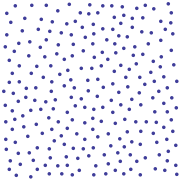
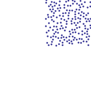
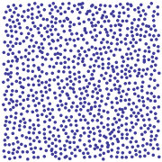
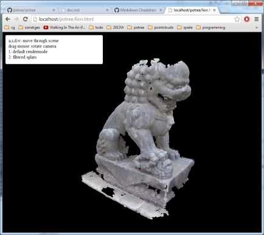

# Documentation

* [File Format Description](./file_format.md)
* [How Nodes Are Loaded](./how_does_loading_nodes_work.md)

## Introduction

Potree is a WebGL based viewer for large point clouds. The idea is that, similar to Google Maps, only visible parts up to a certain level of detail 
will be loaded and displayed. In order to achieve this, points are partitioned into an octree.
The root node r contains a sparse subset of the data. All of its children contain another sparse subset which, combined, will gradualy increase 
the level of detail.

|         |  |  |  |
| ------------- |:-------------:| -----:| --- |
| root          | r0, first child of root | root and r0 combined | root and all its children combined |

## Getting Started

1. Deploy potree on a webserver. 
2. Open lion.html.

This is the result:

## Compatibility

| Browser              | Result        |
| -------------------- |:-------------:|
| Chrome 32            | works         |
| Firefox 26           | works         |
| Safari               | works         |
| Opera 19             | works         |
| Internet Explorer 11 | does not work |

