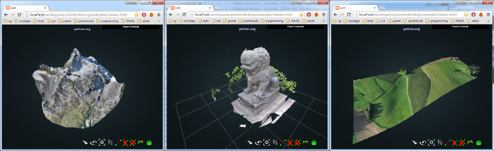

# Documentation

* [Getting Started](getting_started.md)
* [Changelog](changelog.md)
* [User Interface](user_interface.md)
* [Converting Point Clouds](converting.md)
* [FAQ](faq.md)
* [Measuring](measuring.md)
* [File Format](file_format.md)

## About

Potree is a free open-source WebGL based point cloud renderer for large point clouds.
Similar to map software like Google Maps or OpenStreeMap, only data inside the visible area and up to a certain level of detail are loaded.

At the moment, this project is continued as master thesis under the [Harvest4D Project](https://harvest4d.org/)

Newest information and work in progress is usually available on [twitter](https://twitter.com/m_schuetz)

General infos, downloads, showcase, etc. at [potree.org](http://potree.org/)

## Downloads

* [PotreeConverter windows binary (2014.12.30)](http://potree.org/downloads/PotreeConverter/PotreeConverter_2014.12.30.zip)

## Showcase

Take a look at the [potree showcase](http://potree.org/wp/demo/) for some live examples.

## Compatibility

| Browser              | OS      | Result        |
| -------------------- |:-------:|:-------------:|
| Chrome 39            | Win7    | works         |
| Firefox 34           | Win7    | works         |
| Internet Explorer 11 | Win7    | partially works; performance issues |
| Firefox              | Android | partially works, GUI and stability issues |
| Opera                | Android | partially works, GUI and stabilty issues and slow |

## Credits

* The multi-res-octree algorithms used by this viewer were developed at the Vienna University of Technology by Michael Wimmer and Claus Scheiblauer as part of the [Scanopy Project](http://www.cg.tuwien.ac.at/research/projects/Scanopy/).
* [Three.js](https://github.com/mrdoob/three.js), the WebGL 3D rendering library on which potree is built.
* [plas.io](http://plas.io/) point cloud viewer. LAS and LAZ support have been taken from the laslaz.js implementation of plas.io. Thanks to [Uday Verma](https://twitter.com/udaykverma) and [Howard Butler](https://twitter.com/howardbutler) for this!
* [Harvest4D](https://harvest4d.org/) Potree currently runs as Master Thesis under the Harvest4D Project
* [Martin Isenburg](http://rapidlasso.com/), [Georepublic](http://georepublic.de/en/), [Sigeom Sa](http://www.sigeom.ch/), [SITN](http://www.ne.ch/sitn), [Pix4D](http://pix4d.com/) as well as all the contributers to potree and PotreeConverter and many more for their support.
