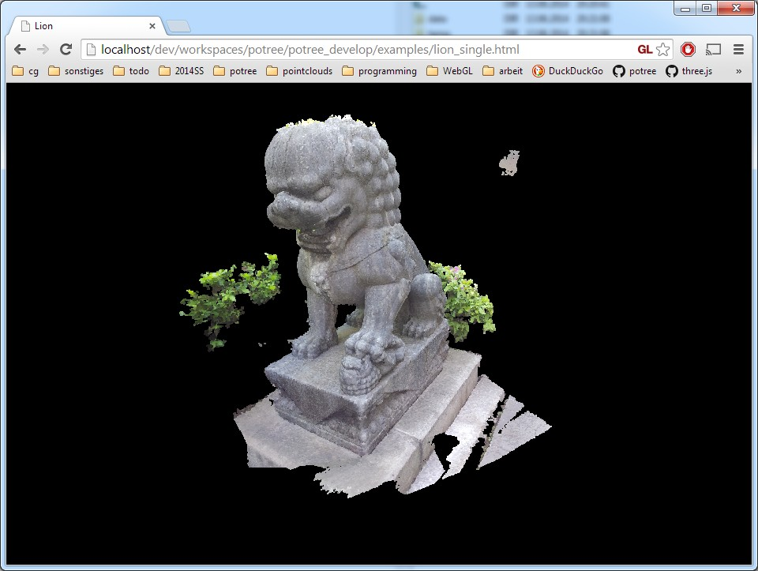

# Getting Started

### Download PotreeConverter

* [PotreeConverter](https://github.com/potree/PotreeConverter)

### Setup a Web-Server

Due to strict security policies in browsers, it is not possible to open potree html files directly because potree needs permission to load files. You have to put all necessary source files and the pointcloud on a webserver to view the result. 
You can, however, install a local webserver on your machine. There are multiple options here but here we propose three simple cross platform options, SimpleHTTPServer, live-server and XAMPP.

#### Python / SimpleHTTPServer

For any machine with Python installed, from the command line in the directory of the Potree HTML files:

```python –m SimpleHTTPServer```

And go to localhost:8000 in your browser


#### live-server
[live-server](https://www.npmjs.com/package/live-server) is a simple node web server. It also has the benefit that it automatically refreshes a page on changes to a file. To do this you must have [node.js](https://nodejs.org/en/) and npm (which comes by default with node) installed on your machine, then from the folder with the Potree HTML files do:

  ```
  npm install -g live-server
  live-server
  ```

This will automatically open the page directory in your default browser and you can select the page you want from the GUI. If you lose the page it will be on localhost with the port given in the command line when you invoke the command. 


#### XAMPP
Another option is [XAMPP](https://www.apachefriends.org/de/index.html), which contains the web server [Apache](http://httpd.apache.org/) as well as PHP and MySQL (although these are not required).

After you've installed and started Apache/XAMPP, you can access files in your htdocs directory through a localhost URL. Assuming your htdocs directory is ```C:\xampp\htdocs```, you can access it in your browser with ```http://localhost```

### Converting & Generating a Web Page

Try this for your first point cloud and then take a look at the [PotreeConverter page](https://github.com/potree/PotreeConverter) to learn more about the converter options:

```
./PotreeConverter.exe C:/pointcloud.las -o C:/xampp/htdocs/potree --generate-page pageName
```

You should now be able to open the generated potree page at this URL: ```http://localhost/potree/examples/pageName.html```


