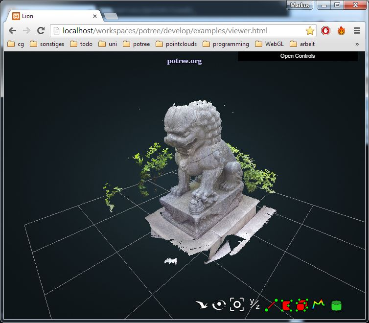

# Getting Started

Read the [FAQ](faq.md) if you encounter any problems.

## Download Potree & PotreeConverter

* [Potree](https://github.com/potree/potree/archive/master.zip)
* [PotreeConverter](http://potree.org/downloads/PotreeConverter/PotreeConverter_2014.12.30.zip)


## Converting A Point Cloud

Potree requires a special point cloud format. Use the PotreeConverter to convert your las or laz files.

Try this for your first point cloud and then take a look at [conversion manual](converting.md) to learn more about the converter options to get better results:
```
./PotreeConverter.exe pointcloud.las -l 3
```

Copy the converted point cloud directory (with cloud.js + data directory) to _potree/resources/pointclouds_

## Creating the Web Page

Copy potree/examples/viewer.html and change the path to your own point cloud.

```
var pointcloudPath = "../resources/pointclouds/my_own_pointcloud/cloud.js";
```

## Deploying Potree On A Webserver

Due to strict security policies in browsers,
it is not possible to open potree html files directly on your pc because
potree needs permission to load files.
You have to put all necessary source files and the pointcloud on a webserver
to view the result. You can, however, install a local webserver on your pc.
I use XAMPP, which contains Apache Webserver as well as PHP and MySQL but Apache
alone should work fine:
* [Apache](http://httpd.apache.org/)
* [XAMPP](https://www.apachefriends.org/de/index.html)

After you've installed apache/XAMPP, start it and copy your potree directory
to the htdocs directory. You should now be able to access your localy hosted files like this:

    http://localhost/potree/examples/my_own_viewer.html



