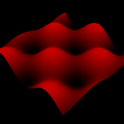

# How To Create Or Load Your Own Pointclouds

This section will explain some approaches to create and display your own point cloud data without using 
the PointCloudOctree and some important things to consider regarding performance.

* Use [Typed Arrays](https://developer.mozilla.org/en-US/docs/Web/JavaScript/Typed_arrays) for your point data. 
They're fast and since the last step is to send point data as a typed array to the GPU, 
it's best to use them at all times. 
* Allocate all the memory you need to store your points at the beginning.  
Avoid resizing arrays. Each point usually requires 16 bytes so initialize your ArrayBuffer with numPoints*16.

## Building A Buffer From Scratch

In this example, we'll create a procedurally generated patch.  

Each point needs 16 bytes. The first step is to create a buffer that can store all points,
as well as 2 views. floatView is required to write xyz coordinates in the buffer and byte view
is required to write rgba colors. 
 
    var width = 100;
    var depth = 100;
    var numPoints = width*depth;
	var buffer = new ArrayBuffer(numPoints*16);
	var floatView = new Float32Array(buffer);
	var byteView = new Uint8Array(buffer);
	
In the next step, we'll write coordinates and colors into the buffer. 

    var offset = 0;
    for(var i = 0; i < width; i++){
    	for(var j = 0; j < depth; j++){
    		var x = 10*((i / width)-0.5);
    		var z = 10*((j / depth)-0.5);
    		var y = Math.cos(x) * Math.sin(z);
    		
    		var r = 100*(y+1);
    		var g = 0;
    		var b = 0;
    		
    		floatView[4*offset+0] = x;
    		floatView[4*offset+1] = y;
    		floatView[4*offset+2] = z;
    		byteView[16*offset+12] = r;
    		byteView[16*offset+13] = g;
    		byteView[16*offset+14] = b;
    		byteView[16*offset+15] = 255;
    		offset++;
    	}
    }
    
Now that the buffer is finished, you'll have to describe its contents with some PointAttributes:

    var pointAttributes = new PointAttributes();
    pointAttributes.add(PointAttribute.POSITION_CARTESIAN);
    pointAttributes.add(PointAttribute.RGBA_PACKED);
    
And send the data to the GPU. This is done by creating a PointCloud object and 
setting the vertex buffer data:

    var pointCloud = new PointCloud("cloud", pointAttributes);
    pointCloud.setVertexBufferData(buffer);
    pointCloud.size = numPoints;
    
In the last step, we create a PointCloudSceneNode from our pointCloud data and attach it to the rootNode:

    var sceneNode = new PointCloudSceneNode("procedural patch", scene.rootNode, pointCloud);

## Loading A Buffer With XMLHttpRequests

XMLHttpRequests can be used to fetch data from a page or file on a webserver. 
It's usually used to load html or text files but it is also possible to load array buffers 
that contain point cloud data.

First, create a request to an URL. We're about to request arraybuffer data so 
we have to use an asynchronous request.  

    var url = ...
    var async = true;
    var xhr = new XMLHttpRequest();
    xhr.open('GET', url, async);
    
These 2 settings specify that we want arraybuffer data:

    xhr.responseType = 'arraybuffer';
    xhr.overrideMimeType('text/plain; charset=x-user-defined');

Since we're using an asynchronous request, we must specify a function that is called when 
our request state changes. Once the request is finished, xhr.readyState is set to 4 so we will check 
for this case. We also have to check xhr.status. A value of 200 means, that the request was successfull.
If it was, we retrieve the buffer from xhr.response and do something with it inside displayPointCloud(buffer, url).

    xhr.onreadystatechange = function() {
    	if (xhr.readyState == 4) {
    		// when accessing local files, req.status will be 0
    		if (xhr.status == 200 || xhr.status == 0) {
    			var buffer = xhr.response;
    			displayPointCloud(buffer, url);
    		} else {
    			console.log('Failed to load file! HTTP status: ' + xhr.status + ", file: " + url);
    		}
    	}
    };

Let's say, buffer is already in the correct format. We can send it directly to the GPU without
further processing and then attach it to the scene:

    displayPointCloud = function(buffer, name) {
    	var pointAttributes = new PointAttributes();
    	pointAttributes.add(PointAttribute.POSITION_CARTESIAN);
    	pointAttributes.add(PointAttribute.RGBA_PACKED);
    
    	var pointCloud = new PointCloud(name, pointAttributes);
    	pointCloud.setVertexBufferData(buffer);
    	pointCloud.size = buffer.byteLength / pointAttributes.byteSize;
    
    	var sceneNode = new PointCloudSceneNode("pointcloud node", Potree.currentScene.rootNode, pointCloud);
    };

 
## Unloading a PointCloud

Sometimes it's necessary to delete unused point clouds in order to free memory for new point clouds.
Use PointCloud.unload to delete data from the GPU.

    var pointcloud = ...
    pointcloud.unload()
    
    
