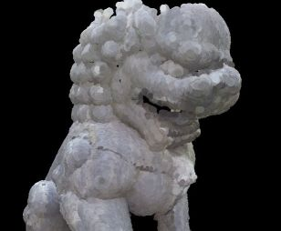
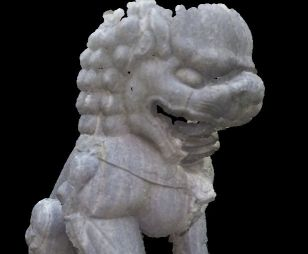
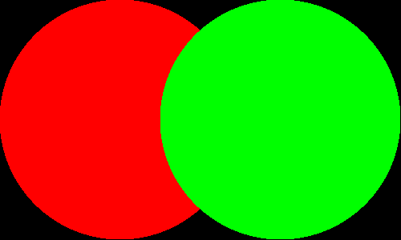
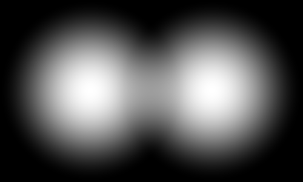
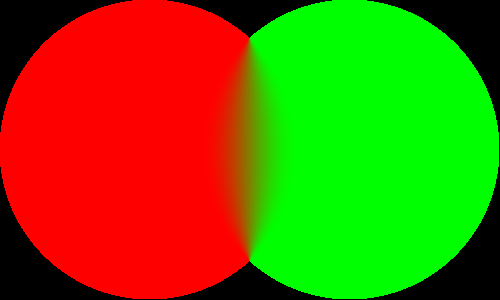

# Materials And Rendermodes

The default material for point clouds is an instance of PointCloudMaterial with the name "pointCloud".
In order to change its attributes, you have to retrieve it by calling:

    var material = MaterialManager.getMaterial("pointCloud");

There are 3 rendermodes available:

* <b>FIXED_CIRCLE</b>
Render points as circles with a fixed size. The pointSize attribute indicates the pixel diameter.
* <b>WEIGHTED_CIRCLE</b>
Render points as circles with a size depending on the distance to the viewer.  
* <b>FILTERED_SPLAT</b>
Interpolates between overlapping points. High quality but very slow.

You can change the render mode by calling

    material.renderMode = PointCloudRenderMode.FIXED_CIRCLE;
    
|  |  |  |
| --------------------------------------- | ------------------------------------------ | ----------------------------------------- |
| FIXED_CIRCLES with point-size 2. All points have pixel diameter 2.| WEIGHTED_CIRCLES with point-size 1. Size varies depending on distance from camera. | FILTERED_SPLATS with point-size 1. In this mode, points have the same size as with WEIGHTED_CIRCLES, but overlapping points are interpolated. |   
 
 
## PointCloudMaterial
 
PointCloudMaterial is actually a combination of other materials.
It dispatches render calls to the material in use.

## FixedPointSizeMaterial

Used when rendermode is set to FIXED_CIRCLE.
The _render(sceneNode, renderer)_ function extracts extracts all pointCloud from sceneNode,
that should be rendered. The _renderPointClouds()_ function invokes the WebGL 
draw calls.

## WeightedPointSizeMaterial

Used when rendermode is set to WEIGHTED_CIRCLE.
It works the same way as FixedPointSizeMaterial, except with a different vertex shader
that adjusts the point size according to the distance from the viewer.

## FilteredSplatsMaterial

Used when rendermode is set to FILTERED_SPLATS.
This material is based on the paper [High Quality Splatting on Today's GPUs](http://graphics.ucsd.edu/~matthias/Papers/HighQualitySplattingOnGPUs.pdf).

The idea is, that overlapping points should be blended together, if their distance to the viewer is roughly the same.
Simple point rendering usualy leads to overlapping points: 

This material consists of 3 passes:

1. <b>Depth-Pass</b> Renders the point cloud into a depth buffer. Depth values are pushed away from the viewer with an offset given by uBlendDepth.
Fragments within this offset-range will be blended together. Fragments that are farther away will be discarded during the depth test. 
2. <b>Attribute-Pass</b> Renders the point cloud with weighted attributes and blend mode set to ADD.
The weight function gives fragments that are closer to the center a higher weight. 
The result of this pass is a weighted sum of overlapping attributes, stored in the RGB component:  
  
And the sum of weights, stored in the alpha component: 

3. <b>Normalization-Pass</b> In this pass, the output of the previous pass is normalized by 
dividing the weighted sum of colors in the RGB component by the sum of weights in the alpha component.
It's essentially a screen-space filter so this time, not the point cloud is rendered but 
a rectangle that spans the whole screen with the output of the previous pass
as the its texture. This is one possible result: 
 
The smoothness of the transition depends on the weight function. By adjusting the weight function, you can get
very smooth or relatively sharp borders. 

