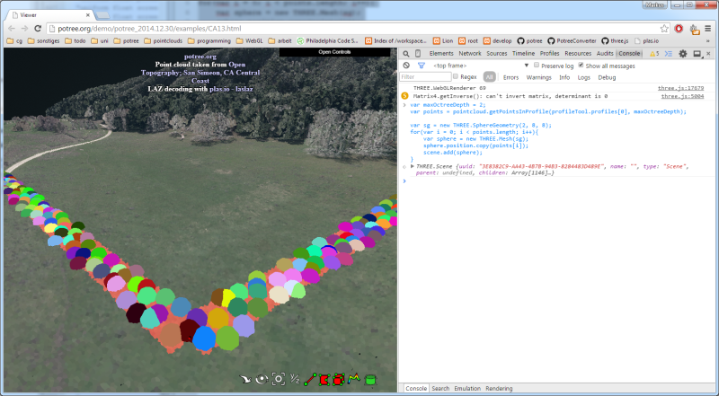
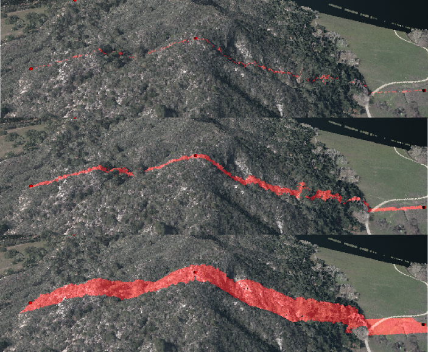

# Scripting

If you're missing some functionality in the interface, you can still achieve certain things by using your browsers developer tools as a scripting console. Open the developer tools with ctrl + shift + i, paste code into the console and execute it.

## Creating a height profile

A height profile can be created with code as follows:

```javascript
var p = new Potree.HeightProfile();
p.addMarker(new THREE.Vector3(-100,0,0));
p.addMarker(new THREE.Vector3(100,0,0));
p.addMarker(new THREE.Vector3(100,0,100));
p.addMarker(new THREE.Vector3(-100,0,100));
p.setWidth(5);
profileTool.addProfile(p);
```

This will create a profile with 4 points / 3 segments.

With this method, the height of the markers is not necessarly aligned with the point
cloud. Height markers can be removed with

```javascript
p.modifiable = false;
```

The positions can still be modified programmatically through

```javascript
var markerIndex = 0;
var position = new THREE.Vector3(10, 10, 0);
p.setPosition(markerIndex, position);
```

In order to remove a marker, call

```javascript
p.removeMarker(index);
```


## Get points inside height profile

Use this to get a list of points inside the profile.
Points are grouped in segments.

```javascript
var maxOctreeDepth = 2;
var segments = pointcloud.getPointsInProfile(profileTool.profiles[0], maxOctreeDepth);
```

The following code will create a sphere at each point location in the profile:

```javascript
var maxOctreeDepth = 2;
var segments = pointcloud.getPointsInProfile(profileTool.profiles[0], maxOctreeDepth);

var sg = new THREE.SphereGeometry(1, 8, 8);
for(var i = 0; i < segments.length; i++){
	var segment = segments[i];
	for(var j = 0; j < segment.points.numPoints; j++){
		var position = segment.points.position[j];
		var sphere = new THREE.Mesh(sg);
		sphere.position.copy(position);
		scene.add(sphere);
	}
}
```



### Projecting a profile to 2D

Each segment also contains a project() function which aligns the points along the x-axis.
This can be used, for example, to generate 2D height profile images.

```javascript
position = segment.project(position);
```

Consecutive segments are placed next to each other. The following code
creates spheres on the x-axis projected point coordinates:

```javascript
var maxOctreeDepth = 1;
var segments = pointcloud.getPointsInProfile(profileTool.profiles[0], maxOctreeDepth);

var sg = new THREE.SphereGeometry(1, 8, 8);
for(var i = 0; i < segments.length; i++){
	var segment = segments[i];
	for(var j = 0; j < segment.points.numPoints; j++){
		var position = segment.points.position[j];
		position = segment.project(position);
		var sphere = new THREE.Mesh(sg);
		sphere.position.copy(position);
		scene.add(sphere);
	}
}
```


## Set width of height profile

The profile width can be changed either by holding ctrl while dragging one of the
endpoints up and down or using this code:

```javascript
profileTool.profiles[0].setWidth(2);
```


