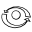

# User Interface

 __Fly-Navigation__

ASDW or Arrow Keys: Move through scene

Left Mouse: Rotate camera

 __Orbit-Navigation__

Left Mouse: Rotate camera around pivot.

Right Mouse: Pan camera & pivot.

 __Zoom to Point Cloud__

Moves camera so that the whole point cloud is within the view area.

 __Flip Y and Z__

Flips y and -z coordinates. Some software uses y as the up vector(WebGL, three.js, potree), others use z.

 __Distance Measurement__

Left Mouse: Insert Measurement Point

Right Mouse: Finish insertion

Drag&Drop: Move Measurement Points

Distance between measurement points will be displayed on the edge.

 __Area Measurement__

Left Mouse: Insert Measurement Point

Right Mouse: Finish insertion

Drag&Drop: Move Measurement Points

Distance between measurement points will be displayed on the edge and the
total area on the centroid.
The area is calculated on the ground plane. The height does not affect the result.
Crossings should be avoided.

 __Volume Measurement__

Left Mouse: Insert Volume or Select Inserted Volume

E, R, T: Switch between translation, scale and rotation mode.

Volume will be displayed on the objects centroid.

 __Height Profile__

Left Mouse: Insert Profile Marker

Right Mouse: Finish insertion

Drag&Drop: Move Profile Marker

ctrl + Drag&Drop: Drag upwards to increase or downwards to decrease the profile width

Depending on the Clip Mode, points inside the profile will be highlighted or points outside the profile will be clipped.

 __Clip Volume__

Left Mouse: Insert Volume or Select Inserted Volume

E, R, T: Switch between translation, scale and rotation mode.

Depending on the Clip Mode, points inside the volume will be highlighted or points outside the volume will be clipped.

